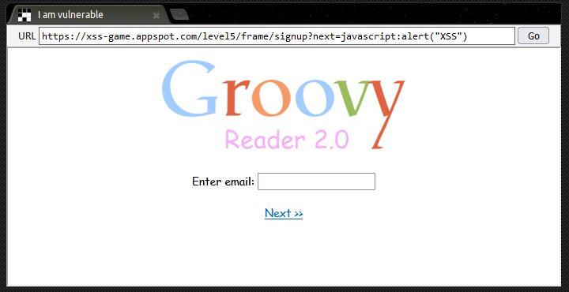

## Background
While working on developing my XSS bug hunting skills I came across a nice little [XSS Game](https://xss-game.appspot.com/) that was released a few years ago by Google.

It's fairly short (only six levels) but did include a couple of interesting attack methods that I thought would be worth writing up.

## Level 1: Hello, world of XSS
This is a very simple level, purely to demonstrate the basic concept of XSS attacks. There is a reflected XSS vulnerability as any content entered into the form field is reflected back to the user on a results page after they click the `Search` button.

When entering a test payload of `<u>XSS Test</u>` we can see that the full payload is reflected back in the HTML of the results page, with no apparent sanitisation of tags or other filtering.

```html
<html>
  <head>
    ...
  </head>

  <body id="level1">
    
      <div>
Sorry, no results were found for <b><u>XSS Test</u></b>. <a href='?'>Try again</a>.
    </div>
  </body>
</html>
```
We can therefore go ahead and use the following basic XSS payload to pop an alert box (something that rarely works in real-world scenarios).

```html
<script>alert("XSS")</script>
```


## Level 2: Persistence is key
At the start of this level we're presented with a simple chat app and invited to "...post anything you want..." It looks as though posts will persist after we've made them so it's time to start thinking about the potential for stored XSS.

Generating a test post with a payload of `<u>XSS Test</u>` shows that once again, there appears to be no santisation or filtering in play. In the following screenshot you can see that the `<u>` tags have been parsed by the browser - this looks promising!


If we try our basic payload again however, it doesn't pop an alert. It seems like the devs have learnt from Level 1 and are filtering out our `<script>` tags so we'll have to try a different attack vector:

```html

```

This payload works as the devs are using a deny-list that only filters out specific tags. This is dangerous as the attacker only needs to find one vector that isn't on the deny list in order to achieve XSS.


## Level 3: That sinking feeling...
This level is where things start to get a bit more interesting since we can infer from the title that we're going to have to find a DOM Sink to successfully execute our attack.

DOM XSS is the third main type of XSS (after reflected and stored) and often goes unnoticed since its harder to detect than the other two types. Because of this, DOM XSS vulnerabilities are also more likely to be present in production environments.

Looking at the source code for the page we can see that the `chooseTab` function has a `num` parameter that is populated with the value of the image a user selects:

```html
...
<script>
      function chooseTab(num) {
        // Dynamically load the appropriate image.
        var html = "Image " + parseInt(num) + "<br>";
        html += "";
        $('#tabContent').html(html);
...
```

We can amend the source of this value (which is the [URL fragment](https://en.wikipedia.org/wiki/URI_fragment) for the page) so that it updates the `` tag in the `chooseTab` function to run our XSS payload:


After updating the URL with our payload, clicking `Go` updates the DOM so that it now contains the following line of code, which pops our alert.

```html

```

Note that the trailing `//` are required in order to comment out the remainder of the line that we're inserting our payload into, so that it's parsed without any errors.


## Level 4: Context matters
This page presents us with a text field where we can input the number of seconds that we want a timer to run for. After the specified time elapses a dialogue box appears telling the user that "Time is up!".

Looking more closely at the source code for the page reveals that the submitted value for the timer is directly added to the startTimer function:

```html

```

More importantly, there is no restriction on the type or number of characters that can be input into the text field, so we can add another payload to trigger XSS:

```js
3'*alert());//
```

In this case, we still add a number to be passed to the `startTimer` function, but we also add an operation that needs to be evaluated before `startTimer` is called. It's when the browser attempts to evaluate `3*alert()` that it pops our alert box.


## Level 5: Breaking protocol
In Level 5 we're introduced 'Groovy Reader 2.0' and asked if we want to sign-up for an exclusive beta programme. The first page doesn't contain any interesting functionality, but on the email entry page we can see that a URL parameter is being used to specify the page that the user should be redirected when they click the `Next >>` link at the bottom of the page.



By adding an XSS payload into the value of the parameter we can update the link target so that our XSS attack will execute when the `Next >>` button is clicked:

```
https://xss-game.appspot.com/level5/frame/signup?next=javascript:alert("XSS")
```

## Level 6: Follow the 🐇
In the final level we're given the challenge of making the application request an external file that will cause it to execute an `alert()`.

As in Level 3, we have a URL fragment to work with. In this case it's the value after the fragment that is used to set the source of the script that will be called by the page.

Again, by checking the source code we can see that the devs have implemented some basic validation. The following code checks for URLs beginning with either `http` or `https`, however, this deny-list approach is again easy to work around.

```js
 // This will totally prevent us from loading evil URLs!
      if (url.match(/^https?:\/\//)) {
        setInnerText(document.getElementById("log"),
          "Sorry, cannot load a URL containing \"http\".");
        return;
      }
```

Since the regex is case sensitive, simply changing one of the letters in http to uppercase will defeat the filter. Alternatively, we can omit http/s altogether by putting `//` in front of target URL. This works because the browser will automatically replace `//` with the protocol used on the page (https in this instance), enabling us to bypass the filter.

Once we've worked around the regex, getting our XSS PoC to trigger is as simple as hosting a `.js` file on a public page and updating the value of the parameter on the page so that it points to our file. In my case I added a file to one of my public GitHub repos and then used [githack.com](http://raw.githack.com) to link to it.


## Congratulations! 🎉
That brings us to the end of what I thought was a pretty fun set of challenges that demonstrate some of the potential options for performing XSS attacks. Time for cake! 🎂

